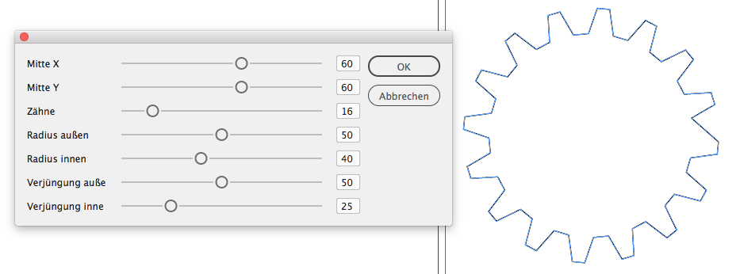

# Zahnräder in InDesign

Ich brauchte neulich mal wieder ein Zahnrad für eine Illustration von irgendwas (das vermutlich meist-missbrauchte Symbol in meiner Branche ;) )

Statt es mit der Hand zu zeichnen, wie sonst immer, dachte ich, das müsste doch auch der Computer übernehmen können. Kurzes Googeln später hatte ich auch bei stackoverflow einen Algorithmus gefunden, der sich leicht auf ID anpassen ließ. (Link im Code)

Den [ScriptUI Scaffolder](https://github.com/gsingelmann/ScriptUI_by_XML) für die UI hatte ich auch vor kurzem erst geschrieben, also los.

## Das Script

Version 1 ist fertig.

Im Screenshot sieht man die vorgesehenen Freiheitsgrade.
Wenn ich mal Langeweile habe, baue ich noch den Innenkreis ein. Das braucht allerdings etwas Refactoring, denn in der jetzigen Version setze ich das Zahnrad einfach mit `item.paths[0].entirePath` und mit dem Innenkreis müsste ich Kreis und Zacken getrennt voneinander handeln.

Verschieben wir das also auf morgen ;)

### Installation

[Die Anleitung liegt nach wie vor hier](https://www.cuppascript.com/scripte-installieren/)